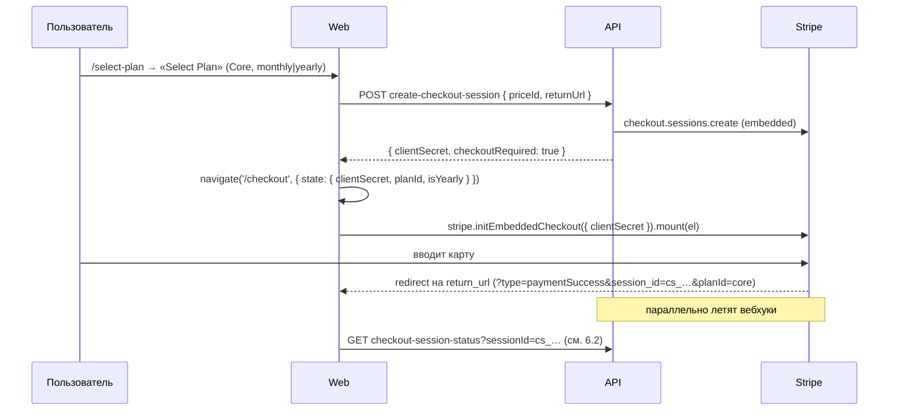

# Оплата и управление подписками — полное описание флоу и edge cases

Документ описывает работающую в проде реализацию биллинга в CueTime (Stripe +
NestJS API + React-клиент) так, чтобы её можно было воспроизвести в другом
проекте. Здесь есть: контракты, пошаговые сценарии, все состояния UI, все
известные edge cases — включая те, что реализованы «как есть» и те, что
остались дырами (они помечены ⚠️ и вынесены в раздел 10 с рекомендациями).

Читать сверху вниз: разделы 1–5 — модель, 6 — флоу, 7–8 — гейтинг и UI,
9–12 — edge cases, дыры, чек-лист внедрения и тест-план.

---

## 1. Архитектура и общие решения

```
Web (React Router + @stripe/stripe-js)
  │  REST (Clerk JWT в Authorization: Bearer)
  ▼
API (NestJS + TypeORM/Postgres)  ──►  Stripe API
  ▲                                     │
  └────────── webhooks (raw body) ◄──────┘
```

Базовые решения, на которых держится всё остальное:

1. **Stripe — единственный источник истины о подписке.** В своей БД хранятся
   только `stripe_customer_id`, `subscription_id` и флаг `payment_failed`.
   Текущий план на каждый запрос вычисляется из Stripe (с кэшем, см. §6.10).
   Плюс: нет рассинхрона состояний. Минус: зависимость от доступности Stripe и
   латентность, которую гасит кэш.
2. **Embedded Checkout** (`ui_mode: 'embedded'`), а не redirect на Stripe-хостед
   страницу. Пользователь не уходит с домена, форма монтируется в свой layout
   рядом с Order Summary.
3. **Один эндпоинт `create-checkout-session` делает две разные вещи** — создаёт
   checkout для нового платящего и делает in-place `subscriptions.update` для
   уже платящего. Клиент отличает их по флагу `checkoutRequired` в ответе.
   Это ключевая развилка всей системы (§5).
4. **Нельзя доверять redirect'у из Stripe.** После возврата на `return_url`
   клиент отдельно спрашивает у бэка реальный статус сессии (§6.2).
5. **Downgrade на бесплатный план = отмена подписки в конце периода.** Никакого
   «переключения на free price» нет.
6. **Квоты никогда не удаляют данные.** Всё сверх лимита блокируется в UI, при
   апгрейде мгновенно возвращается (§7).

---

## 2. Планы, лимиты и источники истины

Четыре тарифа: `access` (free) → `core` → `pro` → `elite`. Биллинг месячный или
годовой (два `price_id` на план).

| | access | core | pro | elite |
|---|---|---|---|---|
| Цена | Free | $19/мес · $200/год | $29/мес · $300/год | $45/мес · $490/год |
| sessions (`maxPresets`) | 3 | 10 | 50 | ∞ (`-1`) |
| messages | 3 | 10 | 50 | ∞ |
| programs (`maxPrograms`) | 1 | 3 | 50 | 100 (на API) / ∞ (на клиенте) ⚠️ |
| displays (`maxDisplays`) | 1 | 2 | 6 | ∞ |
| Online Mode | — | ✔ | ✔ | ✔ |
| CSV upload | — | ✔ | ✔ | ✔ |
| Advanced logs | — | ✔ | ✔ | ✔ |
| CuePilot | — | ✔ | ✔ | ✔ |

`maxPresets` — **на каждый вид отдельно**: 10 означает 10 sessions И 10
messages, а не 10 суммарно. `-1` = безлимит.

### ⚠️ Четыре независимых копии каталога планов

В текущей реализации описание планов и лимитов дублируется в четырёх местах:

| Файл | Что содержит | Кто читает |
|---|---|---|
| `API/src/stripe/plan-catalog.ts` | цены (строками), фичи, price_id из env, лимиты | публичный `GET /stripe/plans` |
| `API/src/quota/plan-limits.ts` | лимиты для серверного энфорсмента (+`maxPrograms`) | `QuotaService` |
| `App/apps/web/constants/subscriptionPlans.ts` | цены, фичи, price_id из `VITE_*` | карточки планов, checkout |
| `App/packages/stores/src/sessionConfig/plans.ts` | лимиты (+`maxDisplays`, +план `demo`) | клиентский гейтинг |

Реально разъехавшиеся значения на момент написания: `elite.maxPrograms`
(100 vs `-1`), `access.canUseGeneralSettings` (`true` в каталоге и на клиенте,
`false` в серверных лимитах), названия фич («CuePilot» vs «onCue»).
**В новом проекте держите один каталог на сервере и отдавайте его клиенту
через `GET /plans`** — эндпоинт уже есть, но клиент его не использует.

### Схема БД (только биллинговые поля)

```sql
ALTER TABLE users
  ADD subscription_id     varchar NULL,  -- sub_..., ставится вебхуком
  ADD stripe_customer_id  varchar NULL,  -- cus_..., ставится вебхуком
  ADD payment_failed      boolean NOT NULL DEFAULT false;
```

Никаких таблиц `subscriptions`, `invoices`, `plan_history` — всё в Stripe.
`stripe_customer_id` должен быть проиндексирован (по нему идёт обратный поиск
пользователя из вебхуков).

---

## 3. Переменные окружения

**API:**

```
STRIPE_SECRET_KEY=sk_...            # required (Joi валидация на старте)
STRIPE_WEBHOOK_SECRET=whsec_...     # required
STRIPE_PRICE_CORE_MONTHLY=price_... # required
STRIPE_PRICE_CORE_YEARLY=price_...  # required
STRIPE_PRICE_PRO_MONTHLY=price_...  # optional → подставляется 'none'
STRIPE_PRICE_PRO_YEARLY=price_...
STRIPE_PRICE_ELITE_MONTHLY=price_...
STRIPE_PRICE_ELITE_YEARLY=price_...
IS_FEATURE_GATING_ON=true           # kill switch серверного гейтинга
```

**Web:**

```
VITE_STRIPE_PUBLISHABLE_KEY=pk_...
VITE_STRIPE_PRICE_CORE_MONTHLY=price_...
VITE_STRIPE_PRICE_CORE_YEARLY=price_...
VITE_STRIPE_PRICE_PRO_*/ELITE_*=price_...
VITE_IS_FEATURE_GATING_ON=true      # kill switch клиентского гейтинга
```

Версия Stripe API прибита в коде: `apiVersion: '2025-06-30.basil'`.
Для вебхука нужен **raw body** — в `main.ts`: `NestFactory.create(AppModule, { rawBody: true })`.

`IS_FEATURE_GATING_ON=false` полностью отключает проверки квот/фич (для демо и
инцидентов), `VITE_IS_FEATURE_GATING_ON=false` дополнительно редиректит
`/select-plan` на `/`. Флаги независимы — держите их согласованными.

---

## 4. API-контракты

Все ответы (кроме вебхука) в конверте `{ success: true, data: ... }`.
Все, кроме `GET /stripe/plans` и вебхука, — под Clerk JWT guard.

### `GET /stripe/plans` — публичный каталог
```jsonc
{ "success": true, "data": [
  { "id": "core", "name": "Core", "description": "...",
    "monthlyPrice": "19", "yearlyPrice": "200",
    "monthlyPriceId": "price_...", "yearlyPriceId": "price_...",
    "features": ["Multi-screen license<br>(2 devices)", "..."],
    "isComingSoon": false, "isRecommended": true,
    "limits": { "maxPresets": 10, "canUseOnlineMode": true, "...": true } }
] }
```
Для free-плана `monthlyPriceId: "free"`; для незаданных в env — `"none"`.

### `POST /stripe/create-checkout-session`
```jsonc
// req
{ "priceId": "price_...", "returnUrl": "https://app.example.com/select-plan?type=paymentSuccess&session_id={CHECKOUT_SESSION_ID}&planId=core" }
// res A — нужен чекаут (новый платящий)
{ "success": true, "data": { "sessionId": "cs_...", "clientSecret": "cs_..._secret_...", "checkoutRequired": true } }
// res B — подписка изменена/возобновлена на месте
{ "success": true, "data": { "sessionId": null, "clientSecret": null, "checkoutRequired": false, "subscriptionId": "sub_..." } }
// res C — оплата не прошла
400 { "message": "Payment failed. Please check your payment method in the billing portal and try again." }
```

### `GET /stripe/checkout-session-status?sessionId=cs_...`
```jsonc
{ "success": true, "data": { "outcome": "succeeded" } }
{ "success": true, "data": { "outcome": "incomplete", "sessionStatus": "open", "paymentStatus": "unpaid" } }
{ "success": true, "data": { "outcome": "expired" } }
// 400 если sessionId пустой / не начинается с "cs_" / сессия не найдена
// 403 если session.metadata.clerkUserId !== текущий пользователь
```

### `GET /stripe/active-subscription` — текущий план
```jsonc
{ "success": true, "data": {
  "id": "core",                                        // access|core|pro|elite
  "currentBillingCycle": "June 15, 2025 - July 14, 2025", // или "none"
  "billingInterval": "month",                          // month|year|none
  "validUntil": "2025-07-14T00:00:00.000Z",            // только если запланирована отмена
  "cancelAtPeriodEnd": false,
  "paymentFailed": false,
  "hasBillingHistory": true                            // = есть stripe_customer_id
} }
```

### `POST /stripe/cancel-subscription`
Ставит `cancel_at_period_end: true`. Тело пустое. Возвращает объект подписки Stripe.
⚠️ Опирается на `user.subscription_id` в БД; если он null — бросает `Error('Subscription not found')` (500).

### `GET /stripe/preview-plan-change?priceId=price_...`
```jsonc
{ "success": true, "data": {
  "amountDue": 1234,        // в центах; отрицательное = кредит на аккаунт
  "currency": "usd",
  "paymentMethod": { "brand": "visa", "last4": "4242" }  // или null
} }
```
Внутри — `stripe.invoices.createPreview` с `proration_behavior: 'always_invoice'`.
Карта резолвится каскадом: `subscription.default_payment_method` →
`customer.invoice_settings.default_payment_method` → `customer.default_source`.
Ошибка получения карты не валит запрос (превью важнее).

### `POST /stripe/create-customer-portal-session`
`{ "returnUrl": "..." }` → `{ "success": true, "data": { "url": "https://billing.stripe.com/..." } }`.
⚠️ Без `stripe_customer_id` бросает 500 — на клиенте кнопку надо показывать
только при `hasBillingHistory`.

### `POST /stripe/webhook`
Отдельный контроллер, без guard. Проверка подписи `stripe.webhooks.constructEvent(rawBody, sig, secret)`.
400 при отсутствующей/невалидной подписи или пустом raw body. Иначе всегда `{ received: true }`.

---

## 5. Развилка `create-checkout-session` (сердце системы)

```
POST /stripe/create-checkout-session { priceId }
        │
        ├─ у юзера нет stripe_customer_id ──────────────► создать Embedded Checkout
        │                                                 (checkoutRequired: true)
        └─ есть customer_id
              │ subscriptions.list({ customer, status: 'all', limit: 10 })
              │ найти первую подписку в «живом» статусе:
              │   active | trialing | past_due | unpaid | incomplete | paused
              │
              ├─ живой подписки нет ────────────────────► создать Embedded Checkout
              │
              └─ живая подписка есть
                    ├─ priceId совпадает с текущим
                    │     ├─ cancel_at_period_end === true → снять отмену
                    │     │   (update { cancel_at_period_end: false, proration_behavior: 'none' })
                    │     │   → инвалидировать кэш плана → checkoutRequired: false
                    │     └─ иначе → no-op → checkoutRequired: false
                    │
                    └─ priceId другой  → subscriptions.update({
                            cancel_at_period_end: false,
                            proration_behavior: 'always_invoice',
                            payment_behavior: 'error_if_incomplete',
                            items: [{ id: currentItemId, price: priceId, quantity: 1 }] })
                          ├─ StripeCardError / StripeInvalidRequestError /
                          │  code ∈ {card_declined, insufficient_funds, expired_card,
                          │          incorrect_cvc, processing_error, incomplete_payment}
                          │      → 400 «Payment failed…»
                          ├─ статус после апдейта ∈ {past_due, incomplete, unpaid}
                          │      → 400 «Payment failed…»   ← защита от «тихого» фейла
                          └─ иначе → инвалидировать кэш → checkoutRequired: false
```

Почему так:
- `always_invoice` — пользователь платит разницу сразу, а не «в следующем счёте»,
  поэтому апгрейд ощущается мгновенным.
- `error_if_incomplete` — чтобы отказ карты пришёл синхронно ошибкой, а не
  превратился в подписку в статусе `incomplete`.
- Пост-проверка статуса — потому что Stripe умеет обновить подписку **без
  исключения**, а инвойс провалить асинхронно. Без неё UI показывал бы
  «успешно» при неоплаченном апгрейде. Это реальный баг, который чинили.

Параметры создаваемой Checkout-сессии:
```ts
{ ui_mode: 'embedded', mode: 'subscription', payment_method_types: ['card'],
  customer: customerId,                    // undefined для первого раза
  line_items: [{ price: priceId, quantity: 1 }],
  allow_promotion_codes: true,
  return_url: dto.returnUrl,
  metadata: { clerkUserId },
  subscription_data: { metadata: { clerkUserId } } }  // ← обязательно оба!
```
`metadata.clerkUserId` дублируется в `subscription_data`, потому что вебхук
`customer.subscription.created` видит метаданные подписки, а не сессии.

---

## 6. Сценарии

### 6.1 Первая покупка



Детали, которые легко упустить:
- `returnUrl` строится с литеральным плейсхолдером `{CHECKOUT_SESSION_ID}` —
  Stripe подставляет туда id сессии.
- Роут `/checkout` берёт `clientSecret` из `location.state`, не из query.
  Прямой заход/перезагрузка → экран «Checkout session not found» + кнопка
  назад к планам. Секрет намеренно не попадает в URL и историю.
- Order Summary слева считается **из локального каталога цен**, а не из Stripe
  (⚠️ расходится при промокоде/налоге, см. §9).
- Эффект монтирования checkout идемпотентен: `cancelled`-флаг + `instance.destroy()`
  в cleanup, иначе при StrictMode/ре-рендере получаются две формы.

### 6.2 Верификация после возврата (не доверяем redirect)

Stripe редиректит на `return_url` **и когда оплата не прошла** (сессия
осталась `open`). Поэтому:

1. `useModalState` парсит query-параметры страницы в состояние модалки
   (`type=paymentSuccess`, `session_id` → `sessionId`, `planId`).
2. `PaymentSuccessModal` при открытии показывает «Confirming your payment…» и
   дёргает `GET /stripe/checkout-session-status`.
3. Маппинг статуса на бэке:
   - `session.status === 'complete'` **и** `payment_status ∈ {paid, no_payment_required}` → `succeeded`
   - `complete`, но не оплачено → `incomplete`
   - `expired` → `expired`
   - иначе (`open`) → `incomplete`
4. На клиенте:
   - `succeeded` → «Payment Successful!» + `invalidateQueries(['subscription'])`
   - `incomplete` → **поллинг раз в 2 с** (Stripe может дозреть); плюс до 5 ретраев
     на сетевых ошибках с нарастающей паузой (1s→3s)
   - `incomplete`/`expired` в данных → переключение на модалку `paymentCancel`
   - ошибка запроса → **не** пугаем: «Payment processed / We're syncing your
     plan» + инвалидация подписки (деньги, скорее всего, списаны, а вебхук всё
     доделает)
5. Защита от плейсхолдера: если `sessionId` всё ещё содержит
   `{CHECKOUT_SESSION_ID}` (Stripe не подставил), запрос не отправляется.
6. Клиент умеет фолбэк на `/stripe/checkout-session-status/:id` (path-param),
   если query-вариант вернул 404 — наследие рассинхрона деплоев API и веба.

### 6.3 Апгрейд/даунгрейд между платными планами

1. Клик по чужой платной карточке при активной платной подписке → модалка
   `PlanSwitchConfirmModal`.
2. Модалка сразу тянет `preview-plan-change` и показывает:
   `Due today: $X` / `Account credit: $X` (при отрицательном `amountDue`) /
   `No charge` (при 0) и карту `Visa •••• 4242`. Кнопка «Confirm switch»
   заблокирована, пока превью грузится.
3. Confirm → тот же `create-checkout-session` → in-place update (§5).
4. Ответ `checkoutRequired: false` → `PlanSwitchSuccessModal`; ошибка →
   `PlanSwitchErrorModal` с текстом от бэка.
5. Даунгрейд между платными (pro→core) работает так же — Stripe считает
   пропорцию и выдаёт кредит на следующий инвойс.

### 6.4 Переход на годовую оплату

Кнопка «Switch to Annual Billing» показывается, когда:
`isCurrentPlan && план платный && !cancelAtPeriodEnd && billingInterval === 'month'`.
Дальше — тот же путь, что и 6.3, но с `yearlyPriceId` текущего плана.
Есть в двух местах: карточка плана и `MembershipPlanModal` (там при неожиданном
`checkoutRequired: true` показывается подсказка «используйте Change Plan»).

### 6.5 Отмена и даунгрейд на free

Даунгрейд на `access` — это отмена. Путь:

1. Клик «Get started» на карточке Access при платной подписке →
   `DowngradeWarningModal`: **перечисляет конкретные фичи, которые пропадут**
   (разница features текущего плана и access) и дату (`validUntil` или «в конце
   периода»). Кнопки: «Continue to Downgrade» / «Keep My Plan».
2. Далее (и при прямом «Cancel Subscription») — `CancelSubscriptionModal` с
   обязательной анкетой причин (мультивыбор чекбоксов, минимум одна, zod-валидация).
   Заголовок и подписи меняются: «Cancel Plan» vs «Switch to Access Plan».
3. Submit → `POST /stripe/cancel-subscription` → `cancel_at_period_end: true`.
4. `refetch()` подписки → `CancelPlanSuccessModal`: доступ сохраняется до конца
   оплаченного периода, подписку можно вернуть.
5. Пока отмена запланирована:
   - на карточке текущего плана вместо кнопок — «Plan valid until 14.07.2025»
   - кнопка на карточке Access **задизейблена** (нельзя «отменить дважды»)
   - в `MembershipPlanModal` — «Valid until …», блок Current Billing Cycle скрыт
6. ⚠️ Анкета причин никуда не сохраняется — только собирается формой. Если
   аналитика нужна, добавьте эндпоинт/событие.

### 6.6 Реактивация в grace-периоде

Отменил → передумал → выбирает **тот же** план → `create-checkout-session`
видит совпадение price_id и `cancel_at_period_end: true` → снимает отмену с
`proration_behavior: 'none'`. Никакой оплаты, никакого чекаута, деньги не
списываются повторно. Выбор **другого** плана в grace-периоде тоже снимает
отмену — но уже вместе со сменой цены и пропорцией.

### 6.7 Customer Portal

Кнопка «Manage my subscription» → `create-customer-portal-session` с
`returnUrl` (обратно на `/select-plan`, с сохранением мобильного `returnUrl`) →
`window.location.href = url`. Через портал пользователь меняет карту, смотрит
инвойсы, может отменить/сменить план мимо нашего UI — состояние вернётся
вебхуками.

Условия показа кнопки различаются (⚠️ несогласованность):
- `/select-plan`: `subscription.id !== 'access' || paymentFailed`
- `MembershipPlanModal`: `subscription.id !== 'access' || hasBillingHistory`

Правильный признак — `hasBillingHistory` (он же `!!stripe_customer_id`),
иначе портал упадёт 500 для тех, кто никогда не платил.

### 6.8 Покупка из мобильного приложения (handoff)

1. Мобилка открывает браузер на `/select-plan?returnUrl=myapp://…&userId=<clerkId>`.
2. `isAllowedAppReturnUrl` — **allowlist схем** (`myapp`, `myapp-staging`,
   `exp`, `exps`, а также `http(s)` только для `localhost`/`127.0.0.1`),
   длина ≤ 2048, парсинг через `new URL`. Это защита от open redirect —
   обязательно повторить.
3. `returnUrl` протаскивается через все шаги: в `return_url` чекаута, в
   `returnUrl` портала, в query после редиректа.
4. Если `?userId` не совпадает с текущим Clerk-пользователем в браузере →
   модалка **Account Mismatch**: «Continue with current account» (убирает
   `userId` из query) или «Switch account» (`signOut` + возврат на sign-in с
   redirect обратно на select-plan).
5. Все финальные модалки (payment success, plan switch success, cancel success)
   показывают «Continue to the app» / «Stay on web» — первая делает
   `window.location.assign(returnUrl)`, иначе `navigate('/')`.

### 6.9 Вебхуки

| Событие | Что делает |
|---|---|
| `checkout.session.completed` | сохраняет `stripe_customer_id` по `metadata.clerkUserId` |
| `customer.subscription.created` | сохраняет `subscription_id` + `stripe_customer_id`, инвалидирует кэш плана; если в метаданных нет `clerkUserId` — фолбэк: последняя checkout-сессия этого customer |
| `customer.subscription.updated` | резолвит пользователя (метаданные → поиск по customer_id), **инвалидирует кэш**; при `cancel_at` **намеренно не трогает** `subscription_id` — платный доступ живёт до конца периода |
| `customer.subscription.deleted` | `subscription_id = null`, инвалидирует кэш (реальный конец платного доступа) |
| `invoice.payment_failed` | `payment_failed = true`, инвалидирует кэш, `Sentry.captureMessage` с `attempt_count` |
| `invoice.payment_succeeded` | `payment_failed = false`, инвалидирует кэш |
| прочее | breadcrumb «Unhandled webhook event type» |

⚠️ Каждый хендлер обёрнут в try/catch, который **проглатывает исключение**
(логирует в Sentry) — контроллер всегда отвечает 200. Значит Stripe **никогда
не ретраит**, и упавший `checkout.session.completed` навсегда оставит юзера без
`stripe_customer_id`. См. §10.1.

⚠️ Дедупликации по `event.id` нет — при повторной доставке хендлеры выполнятся
снова. Сейчас все операции идемпотентны, так что это безопасно, но проверяйте
это свойство при добавлении новых.

### 6.10 Резолв плана и кэш

`getActiveSubscriptionByClerkUserId(clerkUserId)`:

1. Нет `stripe_customer_id` → `access`, `currentBillingCycle: 'none'`,
   `hasBillingHistory: false`.
2. `subscriptions.list({ customer, status: 'all', limit: 10, expand: ['data.items.data.price'] })`.
3. Первая подписка в «живом» статусе: `active | trialing | past_due | unpaid | incomplete | paused`.
4. `subscriptions.retrieve(id, { expand: ['items.data.price'] })`; если retrieve
   упал — фолбэк на объект из list (тот же маппинг).
5. `price.id` → план через сравнение с env-переменными (`mapCurrentPlan`;
   неизвестный price → `access`).
6. `currentBillingCycle` — строка `"June 15, 2025 - July 14, 2025"` из
   `item.current_period_start/end` (в новом Stripe API периоды живут **на
   subscription item**, а не на подписке — частая ловушка при апгрейде SDK).
7. `validUntil` заполняется **только** при `cancel_at_period_end: true`.
8. Живой подписки нет → `access`, но `hasBillingHistory: true`.

**Кэш плана** (`PlanCacheService`): `Map<clerkUserId, { planId, expiresAt }>`,
TTL 5 минут, in-memory. Инвалидируется вебхуками и при in-place смене плана.
⚠️ Не переживает рестарт и не шарится между инстансами — при нескольких подах
пользователь до 5 минут может видеть разные лимиты на разных запросах.
В новом проекте — Redis.

Клиентский кэш: TanStack Query `['subscription', userId]`, `staleTime` 5 минут,
`retry: 1`; инвалидируется после успешной оплаты, после in-place смены плана и
после отмены (`refetch`).

⚠️ Статусы `past_due`, `unpaid`, `incomplete`, `paused` считаются **дающими
доступ**. Это осознанная политика «не выключать клиента посреди мероприятия»,
но это значит, что неплатящий пользователь сохраняет платные фичи до тех пор,
пока Stripe сам не удалит подписку. Флаг `payment_failed` при этом рисует
баннер, но ничего не ограничивает.

---

## 7. Feature gating

### Сервер (авторитетный)

`QuotaService` (`assertPresetQuota`, `assertProgramQuota`, `assertFeatureAccess`)
вызывается **в контроллерах перед бизнес-логикой**:

| Точка | Проверка |
|---|---|
| `POST /sessions` | `assertPresetQuota(userId, 1, 0)` |
| `POST /messages` | `assertPresetQuota(userId, 0, 1)` |
| `POST /programs` | `assertProgramQuota(userId)` |
| `POST /csv/import` | `assertFeatureAccess('csvUpload')` + `assertPresetQuota(userId, counts.sessions, counts.messages)` — **пре-флайт по всему файлу**, чтобы не было частичного импорта |
| `POST /view-mode-tokens` | `assertFeatureAccess('onlineMode')` |
| выдача device JWT | `assertFeatureAccess('onlineMode')` |

Формат ошибок (403), клиент по ним строит модалки:
```jsonc
{ "error": "QUOTA_EXCEEDED", "quotaType": "programs", "message": "…",
  "limit": 3, "currentCount": 3, "available": 0, "planId": "core" }
{ "error": "FEATURE_NOT_AVAILABLE", "message": "This feature requires a Core plan or above.",
  "feature": "onlineMode", "planId": "access" }
```

Есть также декоратор `@RequiresPlan('core')` + `SubscriptionGuard` с ранжированием
планов (`access:1 < core:2 < pro:3 < elite:4`) — ⚠️ реализован, но **ни к одному
хендлеру не применён**. Либо используйте его вместо точечных вызовов, либо
удалите: два параллельных механизма гейтинга — источник расхождений.

⚠️ `maxDisplays` **нигде не проверяется на сервере**: таблица
`device_registrations` наполняется, но лимит устройств по плану не применяется.
Если продаёте «2/6/100+ экранов» — это надо закрыть.

⚠️ Квоты считаются через `count()` + последующий `insert` без транзакции/лока —
классический TOCTOU: два параллельных запроса могут пробить лимит на единицу.

### Клиент

- XState-машина `sessionConfig` хранит `currentPlan` и отдаёт guard'ы
  `canUseOnlineMode`, `canUseCsvUpload`, `canUseAdvancedLogs`, `canUseCuePilot`,
  `canUseGeneralSettings` — по ним прячутся/блокируются кнопки.
- `useResolvedPlanLimits()` даёт `isPlanResolved` (важно: **до** резолва плана
  ничего не блокируем и не показываем «locked», иначе на первую секунду после
  логина всё мигает заблокированным), `planLimits`, `maxAccessiblePresets`.
- **Locked, not deleted**: первые `maxPresets` sessions/messages доступны,
  остальные показываются заблокированными + баннер `PlanLimitNotice`
  («Some sessions are blocked due to the limits of your current plan.
  Upgrade plan») с крестиком-дисмиссом. То же для programs.
- `QuotaExceededModal` — единая модалка «Plan Limit Reached» с текстом по
  `quotaType` (`presets | programs | screens | csvImport`), показом текущего
  плана и кнопкой «Manage Subscription» → `/select-plan`. У неё же демо-режим
  со своими текстами. Поддерживает `returnTo: 'settings'`, чтобы вернуть
  пользователя в ту модалку, откуда он пришёл.
- Демо-режим — отдельный псевдоплан `demo` в клиентском каталоге (3 пресета,
  всё остальное выключено), без обращения к API.

---

## 8. Карта модалок и состояний UI

| Модалка | Триггер | Что показывает |
|---|---|---|
| `PlanSwitchConfirmModal` | смена платного плана / переход на годовой | превью пропорции (`Due today` / `Account credit` / `No charge`), карта, скелетон на время загрузки |
| `PlanSwitchSuccessModal` | `checkoutRequired: false` | «Plan switched successfully», кнопка Continue (в приложение/на главную) |
| `PlanSwitchErrorModal` | ошибка `create-checkout-session` | текст ошибки от бэка (в т.ч. «Payment failed…») |
| `PaymentSuccessModal` | `?type=paymentSuccess` в query | три состояния: verifying / success / «Payment processed» (при ошибке верификации) |
| `PaymentCancelModal` | `outcome ∈ {incomplete, expired}` | «Payment Cancelled. No charges were made.» |
| `DowngradeWarningModal` | Access при платной подписке | список теряемых фич + дата |
| `CancelSubscriptionModal` + `CancelSubscriptionForm` | «Cancel Subscription» / подтверждённый даунгрейд | анкета причин, обязателен ≥1 пункт |
| `CancelPlanSuccessModal` | успешная отмена | «доступ до конца периода, можно вернуть» |
| `MembershipPlanModal` | из настроек | текущий план, billing cycle, фичи, «Change Plan», «Switch to Annual», «Manage my subscription» |
| `QuotaExceededModal` | 403 QUOTA_EXCEEDED / клиентский лимит | какой лимит, текущий план, «Manage Subscription» |
| Account Mismatch (inline) | `?userId` ≠ текущий | продолжить/сменить аккаунт |

Состояние модалок живёт **в query-параметрах** (zod discriminated union по
`type`), а не в React-состоянии. Это то, что делает возврат из Stripe рабочим:
Stripe редиректит на URL с `?type=paymentSuccess&session_id=…`, и модалка
открывается сама. Отдельно поддержан алиас `session_id` → `sessionId`.

На `/select-plan` пока грузится подписка — **скелетоны карточек**, а не пустой
экран: иначе на секунду мигает «Current Plan: Access» у платящего.

---

## 9. Edge cases (полный список)

### Checkout и возврат
1. **Redirect без оплаты.** Stripe вернёт на `return_url` и при `open`-сессии → всегда верифицируем на бэке (§6.2).
2. **Плейсхолдер не подставлен** (`{CHECKOUT_SESSION_ID}` пришёл как есть) → запрос не шлём, показываем нейтральный экран.
3. **Сессия ещё «дозревает»** (async-методы оплаты) → поллинг 2 с, пока `incomplete`.
4. **Сессия чужого пользователя** → 403 по сверке `metadata.clerkUserId` (иначе по id сессии можно было бы подсмотреть чужой статус).
5. **`sessionId` не в формате `cs_`** → 400 до обращения к Stripe.
6. **Сессия истекла** → `expired` → «Payment Cancelled».
7. **Эндпоинт верификации недоступен** (404/деплой рассинхрон) → фолбэк на path-вариант, затем «Payment processed, syncing» — не пугаем пользователя, у которого деньги списаны.
8. **Пользователь закрыл встроенную форму на полпути** → сессия остаётся `open`, редиректа нет, состояние не меняется; повторный выбор плана создаёт новую сессию.
9. **Перезагрузка `/checkout`** → `location.state` пуст → экран «session not found» + возврат к планам (секрет намеренно не в URL).
10. **Двойной монтаж embedded checkout** (StrictMode/ре-рендер) → `cancelled`-флаг и `destroy()` в cleanup.
11. **Промокод/налог** меняют реальную сумму, а Order Summary считается из локального каталога → расхождение отображаемого «Due today» с фактическим списанием ⚠️.

### Смена плана
12. **Карта отклонена при in-place апгрейде** → синхронная 400 с человеческим текстом (`payment_behavior: 'error_if_incomplete'`).
13. **Stripe обновил подписку, но инвойс упал асинхронно** → пост-проверка статуса `{past_due, incomplete, unpaid}` → 400. Без этого — ложный «успех».
14. **Выбран текущий план повторно** → no-op, без чекаута и без списания.
15. **Выбран текущий план в grace-периоде** → снятие отмены, `proration_behavior: 'none'`.
16. **Выбран другой план в grace-периоде** → одновременно снятие отмены + смена цены с пропорцией.
17. **Даунгрейд pro→core** → пропорция уходит в кредит (`amountDue < 0`), UI пишет «Account credit».
18. **Превью ≠ финальная сумма** (прошло время, изменился налог) — превью нужно перезапрашивать при открытии модалки (`staleTime: 30 s`).
19. **`price_id` не задан в env** → каталог отдаёт `'none'`, на вебе `undefined` → клиент падает в понятное «Price ID not found for this plan», а не в невнятную ошибку Stripe.
20. **У customer несколько живых подписок** → берётся **первая подходящая** из 10 ⚠️ — порядок не гарантирован. Не допускайте множественных подписок (или выбирайте детерминированно: по `created`/`current_period_end`).

### Отмена
21. **Отмена — всегда в конце периода**, немедленной отмены в UI нет.
22. **Доступ во время grace-периода сохраняется**: `customer.subscription.updated` с `cancel_at` **не** обнуляет `subscription_id`; обнуляет только `deleted`.
23. **Повторная отмена** заблокирована в UI (кнопка Access задизейблена, у текущего плана вместо кнопок — «Plan valid until …»).
24. **`user.subscription_id` пуст, а подписка в Stripe есть** (пропущенный вебхук, подписка заведена вручную) → `cancel-subscription` падает 500 ⚠️. Резолв плана при этом работает — расхождение источников. Правильнее: искать подписку в Stripe так же, как это делает резолв плана.
25. **Отмена/смена через Customer Portal** мимо нашего UI → прилетает вебхуком, кэш инвалидируется; свои модалки при этом не показываются.
26. **Анкета причин никуда не пишется** ⚠️.

### Вебхуки и консистентность
27. **Невалидная подпись / пустой raw body** → 400 (и обязателен `rawBody: true`, иначе подпись не сойдётся никогда).
28. **Исключение внутри хендлера** → проглатывается, отвечаем 200 ⚠️ → Stripe не ретраит → возможна навсегда потерянная запись `stripe_customer_id`.
29. **Повторная доставка события** → нет дедупа по `event.id`; спасает идемпотентность операций ⚠️.
30. **Порядок событий не гарантирован** (`subscription.created` может опередить `checkout.session.completed`) → `customer_id` пишется обоими хендлерами.
31. **Нет `clerkUserId` в метаданных подписки** → фолбэк на последнюю checkout-сессию customer'а (`limit: 1`, без фильтра по статусу) ⚠️ — хрупко; правильнее искать пользователя по `stripe_customer_id` в БД.
32. **Гонка «редирект vs вебхук»** → клиент инвалидирует `['subscription']` и по успеху верификации, и по её ошибке.
33. **`payment_failed` завис в `true`**, если `invoice.payment_succeeded` потерялся → у пользователя вечный красный баннер.
34. **Возвраты, чарджбэки, `customer.subscription.paused/resumed`, `trial_will_end` не обрабатываются** ⚠️.

### Доступ и лимиты
35. **`past_due`/`unpaid`/`incomplete`/`paused` = доступ есть** — осознанная политика; фактическое отключение только когда Stripe удалит подписку.
36. **Кэш плана 5 минут, in-memory** → после апгрейда мимо нашего API (портал) до 5 минут старые лимиты; между инстансами — расхождение ⚠️.
37. **Даунгрейд с превышением квоты** → данные не удаляются, лишнее блокируется; апгрейд мгновенно возвращает доступ.
38. **Гонка на квоте** (`count` + `insert` без транзакции) → лимит можно пробить на 1 ⚠️.
39. **CSV сверх квоты** → считаем строки **до** импорта, отказ целиком, отдельный текст модалки («уменьшите файл или апгрейдните план»).
40. **Неизвестный `price_id`** (старая цена, ручная подписка в Stripe) → `mapCurrentPlan` вернёт `access`, платящий пользователь молча потеряет фичи ⚠️. Логируйте такие случаи.
41. **Неизвестный `planId` с бэка** → клиент нормализует в `access` (`normalizePlanId`).
42. **План ещё не загружен** → `isPlanResolved: false`, ничего не блокируем и не помечаем locked.
43. **`IS_FEATURE_GATING_ON=false`** отключает серверные проверки; веб-флаг ещё и редиректит `/select-plan` → `/`. Рассогласование флагов = UI зовёт покупать там, где ограничений нет.
44. **`maxDisplays` не энфорсится** ⚠️.

### Аккаунт и безопасность
45. **Удаление аккаунта не отменяет подписку в Stripe** ⚠️ — пользователь удалён из БД и Clerk, а деньги продолжают списываться. Обязательно чинить в новом проекте.
46. **Мобильный `returnUrl`** проходит allowlist схем (open-redirect guard).
47. **Account mismatch** между `?userId` и залогиненным аккаунтом → явная развилка вместо оплаты «не на тот аккаунт».
48. **Портал без `stripe_customer_id`** → 500; кнопку показывать только при `hasBillingHistory`.
49. **Все биллинговые эндпоинты — под auth**, `userId` берётся **из токена**, никогда из тела запроса.
50. **Ключи**: на клиенте только `pk_...` и `price_...`; `sk_...`/`whsec_...` — только на сервере.

---

## 10. Что сделать иначе в новом проекте

1. **Вебхуки: не глотать ошибки.** Отдавать 5xx, чтобы Stripe ретраил; хранить
   обработанные `event.id` (таблица `processed_stripe_events`) для дедупа;
   писать входящие события в БД до обработки, обрабатывать очередью.
2. **Один каталог планов.** Сервер — источник истины, клиент читает `GET /plans`
   (эндпоинт уже спроектирован под это). Никаких хардкод-цен на клиенте, в том
   числе в Order Summary — суммы брать из Stripe.
3. **Отмена через поиск подписки в Stripe**, а не через `user.subscription_id`;
   `subscription_id` в БД оставить как денормализацию/кэш.
4. **Кэш плана в Redis** (или короткий TTL + `stale-while-revalidate`), чтобы
   инвалидация из вебхука работала на всех инстансах.
5. **Квоты — в транзакции** с блокировкой (`SELECT … FOR UPDATE` по строке
   пользователя) или проверкой на уровне БД-констрейнта.
6. **Один механизм гейтинга**: либо `@RequiresPlan` + guard, либо явные
   `assert*` в контроллерах — не оба.
7. **Энфорсить `maxDisplays`**, раз он продаётся.
8. **Отменять подписку при удалении аккаунта** (и решить: сразу или в конце периода).
9. **Обрабатывать `charge.refunded`, `charge.dispute.created`, `customer.subscription.trial_will_end`**, если появятся триалы/возвраты.
10. **Решить политику по `past_due`**: сейчас доступ не ограничивается вообще.
    Разумный компромисс — grace 3–7 дней, потом даунгрейд до free с явным баннером.
11. **Сохранять причины отмены** (аналитика оттока — единственная ценность этой анкеты).
12. **Хранить снапшот плана в БД** (`plan_id`, `plan_valid_until`) как fallback
    на случай недоступности Stripe — сейчас падение Stripe = падение резолва плана.

---

## 11. Чек-лист реализации с нуля

**Stripe (dashboard)**
- [ ] Продукты Core/Pro/Elite, у каждого — monthly и yearly `price`
- [ ] Customer Portal сконфигурирован (что разрешено менять)
- [ ] Промокоды, если нужны (`allow_promotion_codes: true` в сессии)
- [ ] Webhook endpoint на `/stripe/webhook` с событиями:
      `checkout.session.completed`, `customer.subscription.created|updated|deleted`,
      `invoice.payment_succeeded`, `invoice.payment_failed`

**Backend**
- [ ] `rawBody: true` в bootstrap; вебхук-контроллер отдельно от остальных
- [ ] Валидация env на старте (Joi/zod): секрет, webhook secret, обязательные price id
- [ ] Поля `stripe_customer_id` (индекс), `subscription_id`, `payment_failed`
- [ ] `PlanCatalog` (единственный) + `PlanLimits`
- [ ] Резолв плана из Stripe + кэш + инвалидация
- [ ] 7 эндпоинтов из §4
- [ ] Развилка §5 целиком, включая пост-проверку статуса подписки
- [ ] `QuotaService` + 403-контракты `QUOTA_EXCEEDED` / `FEATURE_NOT_AVAILABLE`
- [ ] Обработчики вебхуков + дедуп + ретраи
- [ ] Sentry-брэдкрамбы на каждом шаге (очень помогают в разборе «где потерялись деньги»)

**Frontend**
- [ ] Страница планов с monthly/yearly тумблером и скелетонами
- [ ] Состояние модалок в query-параметрах (иначе возврат из Stripe не сработает)
- [ ] Роут `/checkout` с `clientSecret` в `location.state`
- [ ] Верификация сессии после возврата + поллинг + все три ветки исхода
- [ ] Превью пропорции перед сменой плана
- [ ] Предупреждение о теряемых фичах перед даунгрейдом
- [ ] «Locked, not deleted» для контента сверх квоты + баннер апгрейда
- [ ] Кнопка Customer Portal только при `hasBillingHistory`
- [ ] Баннер `payment_failed`
- [ ] Allowlist для `returnUrl`, если есть мобильный handoff

---

## 12. Тест-план

**Тестовые карты Stripe:** `4242…4242` — успех; `4000 0000 0000 0002` — отказ;
`4000 0000 0000 9995` — insufficient funds; `4000 0025 0000 3155` — 3DS.

Вебхуки локально: `stripe listen --forward-to localhost:3000/stripe/webhook`,
события — `stripe trigger invoice.payment_failed` и т.д.

Обязательные сценарии:
1. Первая покупка monthly → план обновился, `customer_id` и `subscription_id` записаны.
2. Первая покупка с отказом карты → «Payment Cancelled», план не изменился, денег нет.
3. Закрыть встроенную форму на полпути → состояние не изменилось.
4. Апгрейд core→pro → превью совпало с фактом, лимиты выросли **сразу**.
5. Апгрейд с отклонённой картой → «Payment failed…», план **не** сменился.
6. Даунгрейд pro→core → «Account credit», контент сверх новой квоты заблокирован, но не удалён.
7. Переход на годовой → `billingInterval: 'year'`, кнопка «Switch to Annual» исчезла.
8. Отмена → «Plan valid until …», фичи работают до конца периода.
9. Реактивация тем же планом → отмена снята, повторного списания нет.
10. Отмена → выбор другого плана → отмена снята + смена цены.
11. `customer.subscription.deleted` (симулировать) → откат на access, контент заблокирован.
12. `invoice.payment_failed` → баннер; `invoice.payment_succeeded` → баннер пропал.
13. Дублированный вебхук → состояние не сломалось.
14. Верификация: подставить чужой `session_id` → 403.
15. Мобильный handoff: `returnUrl` со злым URL (`https://evil.com`) → **не** редиректит.
16. `?userId` чужого аккаунта → модалка Account Mismatch.
17. CSV сверх квоты → отказ целиком, ничего не импортировано.
18. Параллельное создание сессий на границе квоты (см. edge case 38).
19. `IS_FEATURE_GATING_ON=false` → всё открыто, `/select-plan` недоступен.
20. Портал: сменить план в портале → в приложении лимиты обновились (учитывая TTL кэша).
